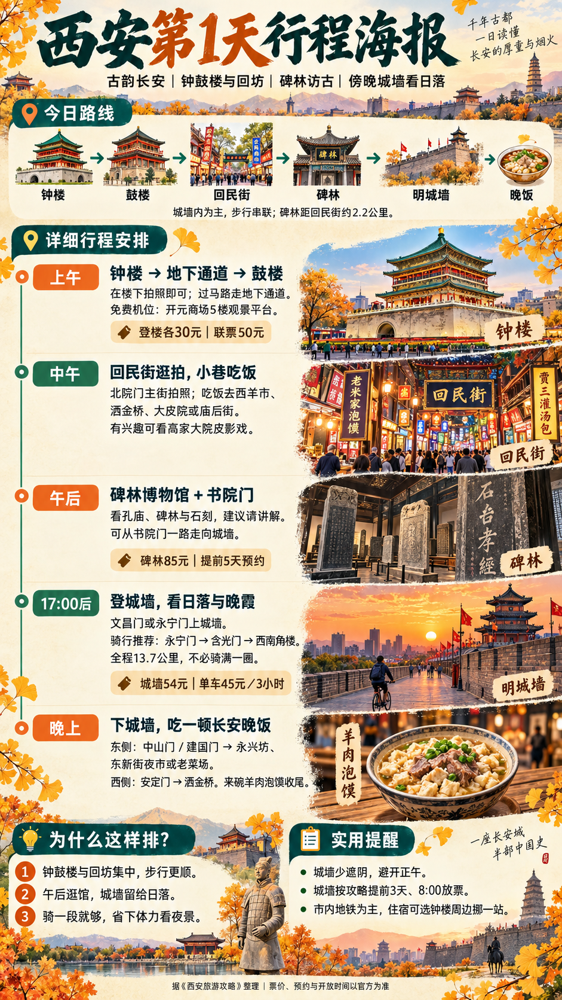
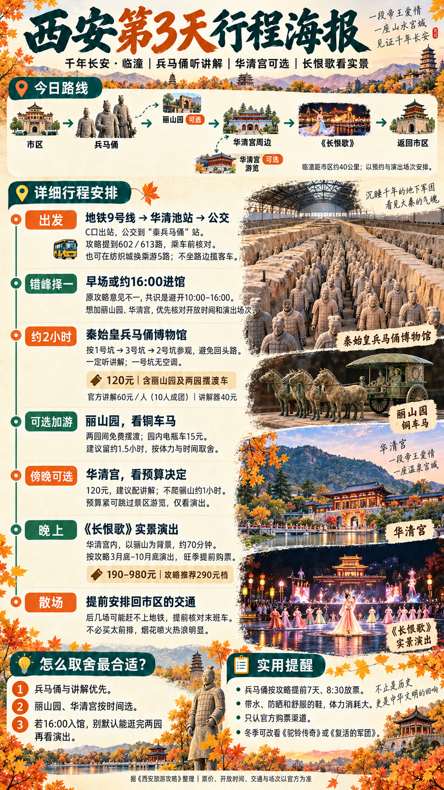
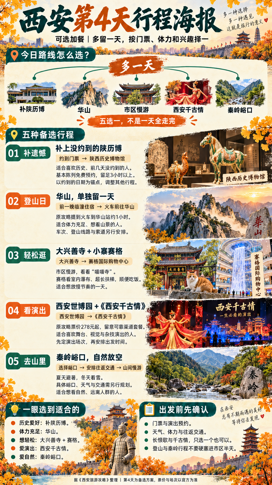

# 西安旅游攻略

三天经典路线 + 第四天可选行程，配套四张中文竖版行程海报。海报参考行程信息图的视觉形式，将路线、时间安排、景点插画与实用提醒重新编排，适合手机查看和保存。

## 下载

- [四张海报打包下载（ZIP，约 11 MB）](downloads/xian-four-day-posters.zip)
- [原版西安旅游攻略（PDF，11 页）](guide/xian-travel-guide.pdf)
- 单张海报：[第 1 天](posters/day-01.png) · [第 2 天](posters/day-02.png) · [第 3 天](posters/day-03.png) · [第 4 天](posters/day-04.png)

## 行程一览

| 天数 | 主题 | 建议路线 |
|---|---|---|
| 第 1 天 | 古韵长安 | 钟楼 → 鼓楼 → 回民街 → 碑林 → 明城墙 → 晚饭 |
| 第 2 天 | 博物馆 + 不夜长安 | 安仁坊 → 博物馆择一 → 午饭 → 大雁塔 → 音乐喷泉 → 大唐不夜城 |
| 第 3 天 | 千年长安·临潼 | 市区 → 兵马俑 → 华清宫周边 →《长恨歌》→ 返回市区；丽山园、华清宫游览可选 |
| 第 4 天 | 可选加餐 | 补陕历博 / 华山 / 市区慢游 / 西安千古情 / 秦岭峪口，择一安排 |

第二天博物馆按预约二选一：约到票去陕西历史博物馆，未约到可选西安博物院 + 小雁塔。第三天原攻略对早场与约 16:00 入馆的建议不同，应按门票、开放时间和演出场次取舍。第四天五种玩法是备选，不是一天全部走完。

## 第 1 天：古韵长安

城墙内步行串联，午后逛碑林，17:00 后登城墙看日落。

## 第 2 天：博物馆 + 不夜长安

白天看文物，傍晚拍大雁塔，晚上看喷泉、逛不夜城。

## 第 3 天：千年长安·临潼

兵马俑与讲解优先，丽山园和华清宫按时间、体力、预算取舍，晚间看《长恨歌》。

## 第 4 天：可选加餐

根据预约门票、兴趣和体力，从五种玩法中选一个。

## 来源与制作

内容依据用户提供的《西安旅游攻略》PDF，原攻略整理于 2026 年 9 月，主要参考视频列于 PDF 第 11 页。海报于 2026 年 10 月 3 日使用订阅内置 Image 2 生成，四张均为 941 × 1672 像素 PNG。

海报中的景点画面是生成式插画与仿实景拼贴。路线为行程示意，不是精确地图；票价、预约规则、开放时间、公交线路和演出场次来自原攻略，出发前请以官方信息为准。

制作细节与提示词见 [制作说明](docs/制作说明.md) 和 [prompts](prompts/)。
